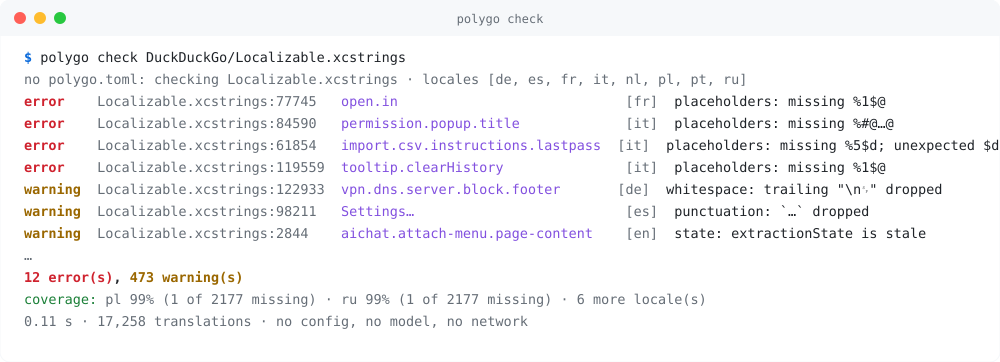

<p align="center">
  <picture>
    <source media="(prefers-color-scheme: dark)" srcset="docs/img/logo-dark.svg">
    
  </picture>
</p>

<p align="center">
  <b>A linter for your app's translations.</b><br>
  The placeholder that went missing in French, the plural form Polish needs, the <code>&lt;/b&gt;</code> a translator dropped:<br>
  <code>polygo check</code> finds them in milliseconds, with a file and line, no config, no model.<br>
  <sub>Strings missing? It translates them too, with a local model. One 4 MB binary. No account, no server, no telemetry.</sub>
</p>

<p align="center">
  <a href="https://crates.io/crates/polygo"></a>
  <a href="https://github.com/Na5co/polygo/actions/workflows/ci.yml"></a>
  <a href="https://github.com/Na5co/polygo/releases"></a>
  <a href="LICENSE"></a>
</p>

<p align="center">
  <picture>
    <source media="(prefers-color-scheme: dark)" srcset="docs/img/check-dark.svg">
    
  </picture>
</p>

<p align="center"><i>Real output on DuckDuckGo's shipped macOS catalog, unmodified. Clone it and run this yourself.</i></p>

<br>

## Install

```sh
curl -fsSL https://raw.githubusercontent.com/Na5co/polygo/main/install.sh | sh
```

Or `brew install na5co/tap/polygo` · `cargo install polygo` · [Windows zip](https://github.com/Na5co/polygo/releases). Then `polygo completions zsh` for tab completion.

<br>

## `polygo check`

```sh
polygo check Localizable.xcstrings      # a file (.xcstrings, .strings, strings.xml, .json, .arb, .po, .resx)
polygo check app/src/main/res           # a folder: format and locales are detected
polygo check Dimillian/IceCubesApp      # a GitHub repo (or any git URL): cloned shallow, checked
polygo check                            # the project, once polygo.toml exists
```

Ten seconds, no setup. It reads the string files your app already has and reports what a user would eventually notice — every finding with the **file and line** where the fix goes:

| code | severity | what it catches |
|---|:-:|---|
| `placeholders` | error | `%1$@`, `{{name}}`, `%(count)s`, `{0}`, `{n, plural, …}` missing, added, retyped or reordered |
| `plural` | error | a CLDR form the locale needs and doesn't have: `few`/`many` for Polish, six for Arabic; ICU, `.xcstrings`, `.stringsdict`, `<plurals>`, `msgstr[n]`, i18next `_few` |
| `markup` | error | `<b>`, `</a>`, `<br>` the source has and the translation lacks, or the reverse |
| `escape` | error | Android: unescaped `'`, or a leading `@`/`?` that `aapt` reads as a resource reference |
| `empty` | error | a translation that is blank |
| `identical` | warning | the translation is the English text |
| `fragment` | warning | half translated: `ようこそ back!` |
| `punctuation` | warning | `Settings…` became `Ajustes`; a trailing `:` or `.` dropped |
| `whitespace` | warning | a leading/trailing space or newline lost (strings glued together in the UI) |
| `orphan` | warning | a key the locale file has and the source no longer does |
| `state` / `fuzzy` | warning | marked `needs_review` in Xcode or `#, fuzzy` in gettext, shipped anyway |
| `length` | warning | 2.5× the source, or a `polygo:max=20` comment exceeded |
| `duplicate` | error | the same key twice in one file; the last one wins silently |
| `array` | error | an Android `<string-array>` with more or fewer items than the source |
| `glossary` | error | a `glossary.toml` term translated, or not rendered as required |
| `encoding` | warning | `é`, `’`: a file saved in the wrong encoding |
| `invisible` | warning | zero-width space, mid-string BOM, bidi controls, control characters |
| `link` | warning | a URL or email in the source that the translation changed or dropped |
| `brackets` | warning | `(` opened and never closed, when the source keeps it balanced |
| `entities` | warning | `&amp;amp;`: an entity escaped twice |
| `inconsistent` | warning | the same short term translated two ways in one locale (`Réglages` ×3, `Paramètres` ×1) |

It ends with the coverage per locale. Exit 1 on errors (`--strict` for warnings too); `--json` for machines; `polygo check --explain punctuation` says what a code means and what to do. A key that is right the way it is: `polygo:ignore=identical` in its comment, or `[keys] ignore = { "legal.*" = ["length"] }` in `polygo.toml`.

**Adopting it on an old catalog:** `polygo check --write-baseline` accepts everything it finds today into `polygo-baseline.json` (commit it). From then on `check` reports and fails only on *new* findings, and tells you when a known one got fixed so you can prune the file. `--no-baseline` shows the whole picture.

**In CI** — one annotation per finding on the PR's Files tab, a table in the job summary, no secrets:

```yaml
- uses: Na5co/polygo/action@v0
  with:
    mode: check
```

`sarif: "true"` also files them in GitHub's Security tab with new/fixed history. Any other CI: `polygo check --github` or `--sarif`. Pre-commit: `entry: polygo check` ([snippet](action/README.md#pre-commit)).

<br>

## Found in the wild

`polygo check` on shipped, production catalogs, unmodified (`polygo check <owner/repo>` reproduces any of these):

| App | Found |
|---|---|
| DuckDuckGo macOS | 12 placeholder bugs: `Ouvrir dans % @` (a space inside `%@`), a dropped `%5$d`, mangled `%#@var@` |
| Ice Cubes | 44 missing Slavic plural forms; a Ukrainian string reading "ключа DeepL API key" |
| boringnotch | 3,374 strings Xcode marks `needs_review`, shipped |
| NewPipe, DuckDuckGo Android | stray `"` that Android silently drops from the UI |
| Penpot | 4 `#, fuzzy` entries gettext shows in English |
| Signal iOS | French strings with literal `<strong>` tags the English source doesn't have; Russian `one` forms without the number, shown for 21, 31, 101 items |

Details in [KNOWN_BUGS.md](tests/corpus/xcstrings/KNOWN_BUGS.md). Zero false positives on 3,756 strings from five Android apps.

The same check over 23 popular open-source apps found about a thousand broken placeholders in production, almost all a translator translating the placeholder name in a language the maintainers don't read. The fixes are landing upstream:

| Project | Fix | Status |
|---|---|---|
| [Open WebUI](https://github.com/open-webui/open-webui/pull/30326) | 22 placeholders in 13 locales (`{{ modelli }}` for `{{ models }}`, `{model}}`) | merged |
| [Dashy](https://github.com/lissy93/dashy/pull/2353) | `{brukernavn}` for `{username}` | merged |
| [AppFlowy](https://github.com/AppFlowy-IO/AppFlowy/pull/9035) | 14 translated placeholder names in 10 locales | open |
| [Cal.diy](https://github.com/calcom/cal.diy/pull/30213) | 10 placeholder names in de, es, et, ro | open |
| [Umami](https://github.com/umami-software/umami/pull/4556) | `{ব্রাউজার}` for `{browser}`, `[[9000]]]` for `{time}` | open |
| [DuckDuckGo macOS](https://github.com/duckduckgo/apple-browsers/pull/6852) | 12 broken `%@` specifiers | open |
| [Ice Cubes](https://github.com/Dimillian/IceCubesApp/pull/2503) | 2 dropped `%@` | open |

Scan results for all 23 in [launch/upstream/FINDINGS.md](launch/upstream/FINDINGS.md); `scripts/scan_upstream.sh owner/repo path` runs it on any repo.

<br>

## Then: translate what's missing

```sh
cd your-app
polygo init          # finds your string files, writes polygo.toml
polygo use gemma4    # pulls a model through Ollama, or openai/… with a key
polygo translate     # new and changed strings, into every target locale
polygo check         # the same checks, on what the model just wrote
git diff             # look it over, commit
```

<table>
<tr>
<td valign="top">

**🔒 Only the diff you meant**<br>
Writes into your existing files byte for byte. A lockfile remembers every source string, so changing one English string re-translates one string. Hand edits are never overwritten.

</td>
<td valign="top">

**🧠 Context from your code**<br>
Before translating "Open" it finds `Button("Open")` in your source and tells the model it's a menu item, plus the closest strings you already translated. Blind-judged by a second model: 9 to 5.

</td>
</tr>
<tr>
<td valign="top">

**🔢 Plurals per language**<br>
Polish gets `one` `few` `many` `other`, Japanese gets one form, each asked for with a concrete count. Written into `.xcstrings` variations, `<plurals>`, `msgstr[n]`, i18next `_few` keys.

</td>
<td valign="top">

**🚫 The model can't talk past `check`**<br>
Every reply is validated before it's written. Wrong twice and the string is quarantined as `needs-review`, not shipped. `polygo review` is a local page to approve or reject.

</td>
</tr>
<tr>
<td valign="top">

**🧑‍⚖️ A second opinion**<br>
`polygo audit` has a *different* model grade each translation 1–5 with a reason. `--fix` redoes the flagged ones and leaves human edits alone.

</td>
<td valign="top">

**🤖 Translate in CI**<br>
The same [GitHub Action](action/README.md) in `mode: translate` opens a PR with new translations and a coverage table on every push.

</td>
</tr>
</table>

<br>

## Formats

| | Format | Used by | What `init` finds |
|:-:|---|---|---|
| 🍎 | `.xcstrings` | iOS, macOS | one catalog with every locale; `%#@var@` substitutions |
| 🍎 | `.strings` | iOS, macOS (legacy) | `<locale>.lproj/Localizable.strings`, UTF-16 kept as is |
| 🤖 | `strings.xml` | Android | `res/values-*/`; `<plurals>` per quantity, `<string-array>` per item |
| 🌐 | `.json` | React, Vue, i18next | `locales/<locale>.json` or `locales/<locale>/<ns>.json`, nested keys |
| 🐦 | `.arb` | Flutter | `l10n.yaml` + `lib/l10n/app_<locale>.arb`, ICU plurals |
| 🐍 | `.po` | Django, Rails, PHP, gettext | `locale/<l>/LC_MESSAGES/*.po` or flat; `msgid_plural` per `Plural-Forms` |
| 🪟 | `.resx` `.resw` | .NET, WinUI | `Name.<locale>.resx`, `<locale>/Resources.resw` |

Every writer round-trips byte for byte, tested on 35 real files from DuckDuckGo, Ice Cubes, Grafana, Django, NewPipe and Penpot, so a translation never hides under a reformatting diff. No string files yet? `polygo extract --rewrite` pulls the text out of your web markup and swaps in `t("key")` calls ([how](docs/extract.md)).

<br>

## Which model

| | Size | Good for |
|---|---|---|
| `qwen3:8b` <sub>default</sub> | 5 GB | UI strings into major languages, on any laptop |
| `gemma4` | 9.6 GB | Smaller languages, Slavic plurals, anything a customer reads |
| `openai/…` `anthropic/…` | API | The same, without a local GPU |

`polygo models` lists them, `polygo use <model>` switches. Honest numbers in [docs/models.md](docs/models.md).

<br>

## Privacy

No telemetry, no account, no server. The only network request is the translation call to the provider in your `polygo.toml`; with Ollama that is `127.0.0.1`. `check`, `status`, `init` and `review` never touch the network at all. [Verify it yourself with `sandbox-exec`.](docs/README.md#privacy)

<br>

## More

[Commands and `polygo.toml`](docs/README.md) · [Per-format notes](docs/formats/) · [GitHub Action and pre-commit](action/README.md) · [Extracting strings from web apps](docs/extract.md) · [FAQ, compared with Lokalise / Crowdin / Weblate](docs/faq.md) · [How it was built](docs/dev/GAUNTLET.md)

<p align="center"><i>MIT · <code>cargo test</code> runs offline in about 10 s</i></p>
