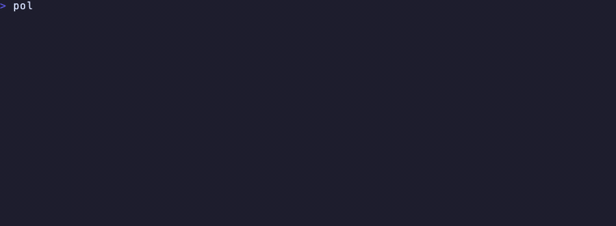

# polygo

**Lokalise for one person.** A 4 MB CLI binary that translates your app's strings with a local model, tracks what changed in a lockfile, and refuses to write a translation with a broken placeholder or a missing plural form.

[](https://crates.io/crates/polygo) [](https://github.com/Na5co/polygo/actions/workflows/ci.yml) [](LICENSE)

For solo developers and small teams shipping an iOS, Android, Flutter, web or .NET app in a few languages. [Lokalise starts at $149/month](https://lokalise.com/pricing) and keeps your strings on its servers. polygo runs in your repo and writes into the files you already have, so the diff is just the new strings.

```sh
curl -fsSL https://raw.githubusercontent.com/Na5co/polygo/main/install.sh | sh
```

<sub>Or `brew install na5co/tap/polygo` · `cargo binstall polygo` · `cargo install polygo` · [Windows zip](https://github.com/Na5co/polygo/releases). Local models run through [Ollama](https://ollama.com) (`brew install ollama`); no Ollama? `polygo use openai/gpt-4o-mini --api-key ...` works the same way.</sub>

## Thirty seconds

```sh
cd your-app
polygo init          # finds your string files, writes polygo.toml
polygo use gemma4    # picks a model and pulls it (or openai/..., anthropic/... with a key)
polygo doctor        # is everything in place? says what to fix if not
polygo translate     # translates new and changed strings into every target locale
polygo check         # placeholders, plurals, lengths; exit 1 on errors
git diff             # look it over, commit
```

`init` recognises `.xcstrings` catalogs, Android `values-*` folders, Flutter `l10n.yaml` and ARB files, i18next `locales/`, gettext `.po` trees and .NET `.resx`/`.resw`. `polygo add fr ja` adds languages later.

### Web app with no string files yet

```sh
polygo extract --dry-run   # lists every piece of UI text it found, with file:line
polygo extract --rewrite   # writes locales/en.json, replaces the strings in the code with t("key"), generates src/i18n.ts
polygo init && polygo add de fr && polygo translate
```

`extract` reads the markup in JSX, HTML inside template literals, and `.html`/`.vue`/`.svelte` files: text between tags plus `placeholder`, `title`, `alt` and `aria-label` attributes. It skips `<script>`, `<style>`, `<svg>`, `<code>`, tests and `node_modules`. `${expr}` and `{expr}` become `{{0}}` placeholders and are passed as arguments: `<p>Signed in as ${email}.</p>` becomes `<p>${t("Signed in as {{0}}.", { 0: email })}</p>`.

`--rewrite` edits `.ts`/`.tsx`/`.js`/`.jsx` files in place, adds the import, and generates a 20-line `i18n.ts` with `t`, `setLocale` and `addCatalog` (no library needed; keys are the English text, so English works with nothing loaded). Review it with `git diff`. Sentences split by inline markup (`writes a <code>.form</code> file`) are listed as fragments and left alone, because translating the pieces separately gives bad results. On a 160-file server-rendered app it rewrote 387 strings in 20 files with no new TypeScript errors.

Keep brand names and whole pages out of it with flags or `polygo.toml`:

```toml
[extract]
ignore = ["Leafslip", "API key"]          # strings containing these are skipped
ignore_paths = ["src/admin*", "legacy/**"]
```

iOS, Android, Flutter and gettext already have their own extractors, so `extract` is for the web.

## What it catches

This is `polygo check` on the DuckDuckGo macOS browser's shipped string catalog, unmodified:

```
$ polygo check
error   Localizable.xcstrings  open.in  [fr]  placeholders: missing %1$@
error   Localizable.xcstrings  open.in  [it]  placeholders: missing %1$@
error   Localizable.xcstrings  permission.popup.title  [it]  placeholders: missing %#@…@
error   Localizable.xcstrings  tooltip.clearHistory  [it]  placeholders: missing %1$@
error   Localizable.xcstrings  preferences.about.more-at  [nl]  placeholders: missing %1$@
error   Localizable.xcstrings  fire.dialog.history.count  [pl]  placeholders: missing %#@…@
error   Localizable.xcstrings  pm.card.expires.format  [pl]  placeholders: missing %1$@
…
12 error(s), 380 warning(s)
```

`Ouvrir dans % @` (a space inside the placeholder), a dropped `%d`, mangled `%#@var@` variables. Across DuckDuckGo and Ice Cubes: **32 placeholder bugs and 44 missing Slavic plural forms**, all in production, plus a Ukrainian string that reads "ключа DeepL API key". Details in [`tests/corpus/xcstrings/KNOWN_BUGS.md`](tests/corpus/xcstrings/KNOWN_BUGS.md).

## Formats

| Format | Used by | What `init` looks for |
|---|---|---|
| `.xcstrings` | iOS / macOS (Xcode 15+) | one catalog with every locale; plural variations and `%#@var@` substitutions translated per CLDR category |
| `strings.xml` | Android | `res/values/` plus `res/values-<locale>/`; `<plurals>` translated per quantity |
| `.json` (i18next) | React / web | `locales/<locale>.json` or `locales/<locale>/<ns>.json`, nested keys; `_one`/`_other` groups get every suffix the locale needs |
| `.arb` | Flutter | `l10n.yaml` pointing at `lib/l10n/app_<locale>.arb`; ICU plurals and `@metadata` |
| `.po` | gettext (Django, Rails, Python, PHP) | `locale/<locale>/LC_MESSAGES/*.po` or flat `<locale>.po`; `msgid_plural` filled per `Plural-Forms` slot |
| `.resx` / `.resw` | .NET / WinUI | `Name.<locale>.resx` or `<locale>/Resources.resw` |

Every writer round-trips byte for byte: parse then serialize gives back the original file. Tested on 35 real files from DuckDuckGo, Ice Cubes, Grafana, Django, NewPipe, Penpot and others, so a translation never hides a real change under a reformatting diff. Per-format notes are in [`docs/`](docs/).

## Why not paste the file into a chat window

| | |
|---|---|
| **Knows what changed** | `polygo.lock` stores a hash of every source string per locale. Change the English and only that string is translated again. Edit a translation by hand and it is marked `edited` and never overwritten. |
| **Reads your code** | Before translating "Open" it finds `Button("Open")` in `LibraryView.swift` and tells the model this is a menu item, not a verb. The most similar strings you already translated ride along so terms stay consistent. In a blind A/B judged by a second model this context won 9 to 5, rest tied. |
| **Does plurals properly** | `%lld photos` becomes four strings for Polish (one, few, many, other) and one for Japanese. Each form is requested with a concrete count so the model picks the right inflection, then written into the format's own plural structure: `.xcstrings` variations, Android `<plurals>`, gettext `msgstr[n]`, i18next `_few`/`_many` keys. |
| **Checks the output** | Placeholders (`%@`, `%1$s`, `{count}`, `{{name}}`, `%(name)s`, `{0}`, ICU plural blocks) have to survive. CLDR plural categories have to be complete. Empty, identical, oversized and half-translated strings (`ようこそ back!`) are flagged. Anything the model gets wrong twice is quarantined as `needs-review` and not written to your files. |
| **Gets a second opinion** | `polygo audit --locale bg` asks a different model to score each translation 1 to 5 with a reason. Structural checks can't see a wrong word; this can. `--fix` re-translates the flagged ones and leaves human edits alone. |
| **Remembers** | Translations a human wrote or approved go into `~/.config/polygo/memory.toml`. The next project that has "Cancel" gets it back without a model call. `polygo memory` shows what is stored. |

<details>
<summary><b>Also:</b> CI, local review page, pseudo-localization, per-key directives</summary>

- **CI.** `polygo check --json --strict` in a pipeline, or the [GitHub Action](action/README.md) that opens a PR with new translations on every push, coverage table included.
- **Review is local.** `polygo review` serves a page on `127.0.0.1` to approve or reject pending translations. Approvals are recorded as human.
- **Pseudo-localization.** `polygo pseudo` writes `[Šáṽé çĥáñĝéš ~~~~]` for every string as `en-XA`. Run the app in that locale to spot hardcoded text and truncation.
- **Per-key control from the code.** `polygo:skip` and `polygo:max=20` in a developer comment are respected by translate and check.

</details>

## Compared with

| | |
|---|---|
| **Lokalise, Crowdin, Phrase** | Hosted translation platforms: web editor, translator accounts, subscription pricing, your strings on their servers. polygo has no server and no accounts; the review step is `git diff`. |
| **Weblate** | Open-source web platform you host yourself (database, web UI, workers). polygo is one binary in the repo with nothing to run. |
| **Editor extensions (i18n Ally and friends)** | Show and edit keys inline while you code. polygo translates in batches, checks in CI and keeps a lockfile; the two sit side by side fine. |
| **A DeepL or Google Translate script** | One string at a time, no code context, no CLDR plural forms, no placeholder check. That gap is what `check`, `audit` and the context engine close. |
| **Pasting the file into ChatGPT** | See the section above. |

polygo is MIT-licensed and open source. There is no hosted tier, no account and no telemetry.

## Which model

`polygo models` lists the options with sizes and notes. The workflow is the same whichever you pick.

| | Size | Good for |
|---|---|---|
| `qwen3:8b` (default) | 5 GB | UI strings into major languages. In a live test: 8 of 8 Polish plural forms, 6 of 8 Russian, rough Bulgarian ("Достъп за достъп"). |
| `gemma4` | 9.6 GB | Smaller languages, Slavic plurals, anything customer-facing. |
| `openai/…`, `anthropic/…` | API | Same as above, no local GPU needed. |

`check` catches structural mistakes, not a wrong word, so step up from the default for anything a customer will read.

```sh
polygo use gemma4                               # pulls through Ollama with a progress bar, writes polygo.toml
polygo use qwen3:14b --global                   # also the default for future `polygo init`
polygo use openai/gpt-4o-mini --api-key sk-...  # key stored in ~/.config/polygo/credentials.toml (0600)
polygo use anthropic/claude-sonnet-5            # or export ANTHROPIC_API_KEY
polygo use openai/llama-3.3-70b --base-url https://api.groq.com/openai/v1   # any OpenAI-compatible server
```

## Privacy

- **No telemetry, no analytics, no update checks.** The only network request polygo makes is the translation call to the provider in your `polygo.toml`. With the default Ollama provider that is `127.0.0.1:11434`. The one opt-in exception: set `PHOENIX_COLLECTOR_ENDPOINT` and prompts and replies are also exported as traces to that address, for your own [Phoenix](docs/README.md#tracing-with-phoenix) instance.
- `check`, `status`, `review` and `init` never touch the network. `translate --dry-run` lists what would be sent and sends nothing. The test suite makes no network calls.
- `polygo review` binds to `127.0.0.1` only and rejects requests whose `Host` header is not localhost.
- Nothing is written outside your repo (`polygo.toml`, `polygo.lock`, your string files) except `~/.config/polygo/` when you ask for it with `--global` or `--api-key`.
- One static binary, about 4 MB, no runtime dependencies. Built on GitHub Actions; every release ships a `SHA256SUMS`.
- API keys come from `POLYGO_API_KEY`, `OPENAI_API_KEY` / `ANTHROPIC_API_KEY`, or `~/.config/polygo/credentials.toml` (mode 0600; the environment wins). They are only sent to the `base_url` you configured.

<details>
<summary>Verify it yourself on macOS</summary>

Block every connection except the local Ollama port and translate anyway:

```sh
cat > offline.sb <<'SB'
(version 1) (allow default) (deny network*) (allow network* (remote ip "localhost:11434"))
SB
sandbox-exec -f offline.sb polygo translate
# translated 2 string(s) in 1 batch(es) with ollama (qwen3:8b)
```

</details>

## Configuration

`polygo init` and `polygo use` write this for you; here is everything it can hold.

```toml
source_locale = "en"
target_locales = ["de", "fr", "ja"]
batch_size = 20        # strings per model call
jobs = 1               # parallel model calls
context = true         # attach code usage and similar translations to prompts
memory = true          # use the cross-project translation memory
glossary = "glossary.toml"

[[files]]
format = "android"
path = "app/src/main/res/values/strings.xml"
locale_path = "app/src/main/res/values-{android_locale}/strings.xml"

[provider]
kind = "ollama"                          # or "openai", "anthropic"
model = "qwen3:8b"
timeout_secs = 300
# base_url = "https://api.openai.com/v1"  # any OpenAI-compatible server: llama.cpp, vLLM, LM Studio, OpenRouter
```

`glossary.toml` pins brand names and required translations:

```toml
do_not_translate = ["Polygo", "GitHub"]

[terms.de]
"Sign in" = "Anmelden"
```

## Commands

| | |
|---|---|
| `polygo init` | detect project type and locales, write `polygo.toml` |
| `polygo add <locale>...` / `polygo remove` | edit `target_locales` |
| `polygo extract [--dry-run] [--rewrite] [--ignore WORD] [--ignore-path GLOB] [--json]` | pull UI text out of web markup into an i18next catalog; `--rewrite` swaps in `t("key")` calls |
| `polygo models` | local models with sizes and notes, marks pulled (`+`) and active (`*`), API options |
| `polygo use <model> [--base-url] [--api-key] [--global] [--no-pull]` | pull an Ollama model or set an API provider, writes `[provider]` |
| `polygo doctor [--json]` | config parses, files load, provider reachable, model pulled; each failure names its fix |
| `polygo translate [--locale de,fr] [--dry-run] [-v] [--retry-review] [--no-context]` | translate new and changed strings; exit 3 if some were quarantined |
| `polygo check [--json] [--strict] [--fix]` | placeholders, plurals, lengths, untranslated fragments; `--fix` re-translates the failures |
| `polygo audit [--locale] [--judge gemma4] [--threshold 3] [--fix] [--json]` | a second model grades translations 1 to 5 with reasons; exit 1 when anything is flagged |
| `polygo pseudo [--locale en-XA]` | write a pseudo-locale to catch hardcoded strings and truncation |
| `polygo memory [--forget]` | cross-project translation memory |
| `polygo status [--json] [--markdown]` | counts per locale; `--markdown` is a coverage table for a README or PR |
| `polygo review [--port 4133] [--open]` | local page to approve or reject quarantined translations |

## FAQ

**Does it work offline?** Yes. The default provider is Ollama on localhost; `check`, `status`, `review` and `init` never use the network at all. See [Privacy](#privacy) for how to prove it with `sandbox-exec`.

**Will it overwrite translations I edited by hand?** No. The lockfile marks them `edited`; `translate` and `audit --fix` skip them. The one exception is `check --fix`, which re-translates a hand-edited string only when it has a structural error such as a missing placeholder.

**Can I use OpenAI, Anthropic, Groq, OpenRouter or my own llama.cpp / vLLM / LM Studio server?** Yes: `polygo use openai/<model> --base-url <url> --api-key <key>`, or `polygo use anthropic/<model>`. Any OpenAI-compatible endpoint works.

**Does it send my strings anywhere?** Only to the provider in your `polygo.toml`, and only the strings that need translating (`translate --dry-run` shows exactly which). With Ollama that is `127.0.0.1`.

**Is it free?** MIT, no account, no tier. Ollama models cost nothing; API models cost whatever your provider charges.

**The model is bad at my language.** Switch to `gemma4` or an API model (`polygo use`), run `polygo audit` to have a second model grade the output, and approve or reject the flagged ones in `polygo review`.

**My app has no string files yet.** Web: `polygo extract` builds `locales/en.json` from your markup. iOS, Android, Flutter and gettext: use the platform's own extractor, then `polygo init`.

**Does it run in CI?** `polygo check --json --strict` fails the build on broken placeholders; the [GitHub Action](action/README.md) translates on push and opens a PR.

## Development

```sh
cargo test                  # offline, about 10 s
cargo test --features live  # also hits a local Ollama
scripts/killtest.sh tests/corpus/xcstrings/loop.xcstrings de   # blind A/B judged by a second model
scripts/demo.sh             # re-record docs/demo.gif (vhs + ffmpeg)
```

MIT
